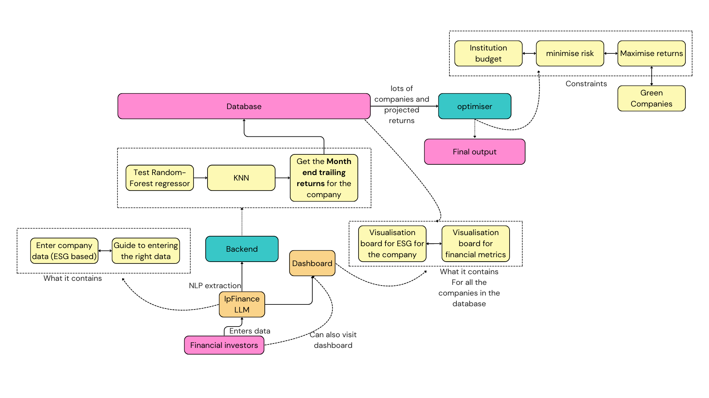

# [IpFin](https://industri-ai-workashwajittayade-gmailcoms-projects.vercel.app/)

  
  
  
  
  
  

A product created in 14 hours, for the hackathon organised by Shaastra 2025.

> [!IMPORTANT]
> What can you do with IpFin?

1. Generate predictions for month end trailing returns of a firm, 1 year before investing in them
2. Figure out which companies are following the green practised and have a higher ESG score
3. Use LP and MIP to generate mathematically optimised results for the perfect green portfolio under budget constraints and risk aversiveness
4. Visualise the company's ESG metrics in a beautiful dashboard to easily comprehend its eco-friendliness

---

> [!NOTE]
> IpFin allows you to be the smartest and greenest investor!

It optimises your portfolio while also ensuring that you generate returns while investing in a green company!

## Workflow

This is how we have coded the website to be like.

## Technical explanations

1. We have used KNN 
