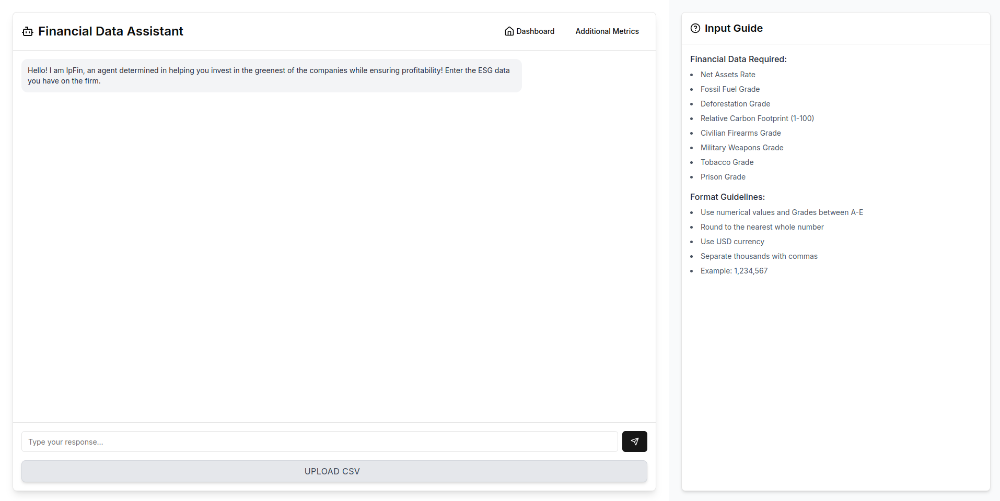

# [IpFin](https://industri-ai-workashwajittayade-gmailcoms-projects.vercel.app/)

  
  
  
  
  
  

#### Authors
[ :trident: Ashwajit Tayade](https://github.com/AST0008)
[ :octocat: Achintya Jai](https://github.com/pUrGe12)

A product created in 14 hours, for the hackathon organised by Shaastra 2025, by team **scared to compile**.

---

> [!IMPORTANT]
> What can you do with IpFin?

1. Generate predictions for month end trailing returns of a firm, 1 year before investing in them
2. Figure out which companies are following the green practised and have a higher ESG score
3. Use LP and MIP to generate mathematically optimised results for the perfect green portfolio under budget constraints and risk aversiveness
4. Visualise the company's ESG metrics in a beautiful dashboard to easily comprehend its eco-friendliness

---

> [!NOTE]
> IpFin allows you to be the smartest and greenest investor!

It optimises your portfolio while also ensuring that you generate returns while investing in a green company!

## Workflow

---

This is how we have coded the website to be like. [video link](./video.mp4)

<video width="500" controls>
  <source src="./video.mp4" type="video/mp4">
  Browser doesn't support video tags
</video>

---

## Technical explanations

### The backend

The backed has been hosted [here]( https://industriai.onrender.com) over at [render](https://render.com/). 

- We have used [flask](https://flask.palletsprojects.com/en/stable/) in the backend as the major tech stack.
- It performs the following 5 important things

1. **NLP/LLM processing** of unstructured data entered by the user (through the prompt bar)
2. Processing of the structured data entered by the user (through the CSV file input)
3. Using KNN trained on a custom dataset to **predict annual returns** of a firm based on **ESG** data. The relevant code is present in [this notebook](https://github.com/AST0008/industriAI/blob/main/backend/helper/ESG_fund_performance_analysis.ipynb).
4. Database implementation through supabase for storing ESG data for companies and displaying them on the dashboard.
5. Using **MIP (mixed-integer programming)** to determine the _optimal investment strategy_ and the perfect porfolio given the constraints.

The constraints under consideration for optimisation are 
- [x] Institution budget
- [x] Risk minimisation
- [x] Favoring **greener companies**
- [x] Ensuring optimal returns on investment

We have developed [this](https://github.com/AST0008/industriAI/blob/main/backend/src/predictor.py) program to take data from supabase and optimise it for you!

### The frontend

The frontend has been hosted on vercel (you can click on the big **IpFin** header to get there!) and anyone can try our service out.

- We have made the frontend entirely in **typescript** and **react** using javascript whenever necessary.
- It offers a beautiful and minimalistic UI that looks sleek and cool!

The code for the frontend resides [here](https://github.com/AST0008/industriAI/tree/pUrGe12-readme/app).
